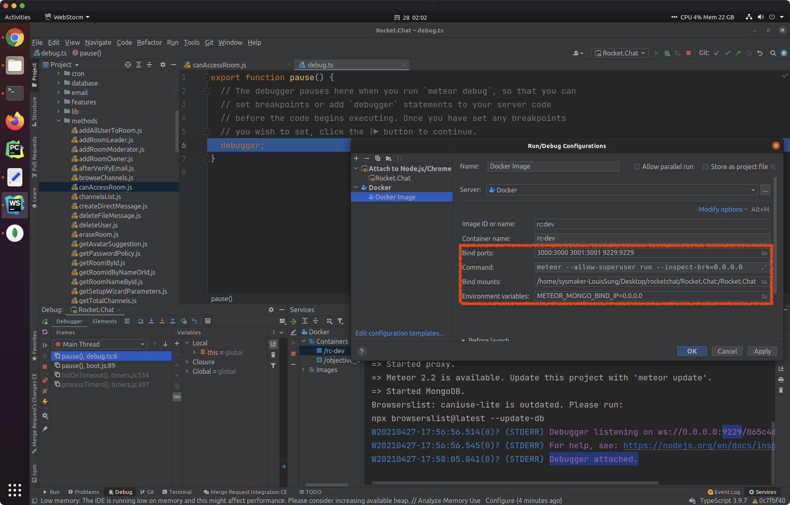
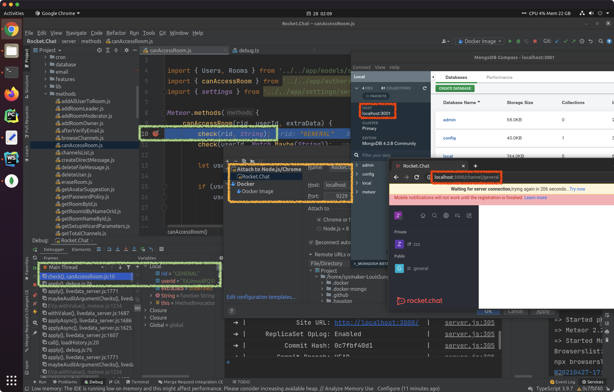

# Rocket.Chat Dev | Dev env set up using Docker
## Docker Image Build
```bash
# build images
./docker/build.sh
```

## Dev Env Setup
```bash
# init (run once)
mkdir rc-dev && cd rc-dev
git clone --branch 3.16.2 https://github.com/RocketChat/Rocket.Chat
git clone --branch recipes/registering-api-endpoints https://github.com/RocketChat/Apps.RocketChat.Tester Apps/recipes
git --git-dir=Rocket.Chat/.git config conre.autocrlf false

docker run --name rc-ssh louissung/rc:dev-3.16.2 cat /app/id_rsa > .rc.key && chmod 600 .rc.key && ssh-add .rc.key && rm .rc.key && docker rm rc-ssh
docker volume create rc-db

# run dev
docker run -idt --name rc-dev -v rc-db:/app/Rocket.Chat/.meteor/local/db -p 2222:22 -p 3000:3000 -p 3001:3001 -p 9229:9229 louissung/rc:dev-3.16.2
# ssh -p 2222 root@localhost

# run prod (see commands in docker/docker-entrypoint.sh)

# register sample plugins (apps)
# visit http://localhost:3000/admin and Checkout `General > Apps > Enable development mode & Enable the App Framework`
docker exec -it rc-dev bash
>>> cd /root/Apps/recipes/
>>> # sed -i 's/export class RocketChatTester/export class AppsRocketChatTesterApp/' AppsRocketChatTesterApp.ts  # fix `There must be an exported class`
>>> rc-apps deploy --url http://localhost:3000 -u <admin_username> -p <admin_password>
```

## Materials
* Official Docs: [Rock.Chat Docs](https://docs.rocket.chat) ([Offline Docs](rocket-chat-docs.pdf.zip) & [Developer Guides](rocket-chat-dev-docs.pdf))
* Meteor Folder structure: [Meteor Guide](https://guide.meteor.com/structure.html#example-app-structure)
* Sample breakpoint: [`server/methods/canAccessRoom.js#L10`](https://github.com/RocketChat/Rocket.Chat/blob/3.14.0/server/methods/canAccessRoom.js#L10)

## WebStorm Run/Debug Configs (OUTDATED)
(outdated for louissung/rc-dev:3.14.0-apps-engine and louissung/rc:dev-3.14.0, use sftp instead)
1. Run Docker container
    
2. Attach JS debugger and MongoDB viewer
    

### Remote Dev Configs
* Excluded path ([`.idea/deployment.xml`](.idea/deployment.xml#L3-L21)), SFTP ([`.idea/webServers.xml`](.idea/webServers.xml)), and SSH ([`.idea/sshConfigs.xml`](.idea/sshConfigs.xml))
